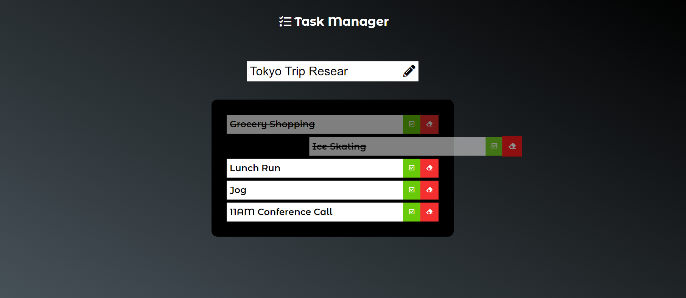

# Task-Manager

Task Manager is a To-Do application meant to be used by anyone. Keep track of simple or complex tasks; it's simple and easy to use. No setup required all tasks are saved on local storage.

# Future ideas
Link the applicatoin to a database such as MySql or MongoDB, create a log in feature to allow multiple users to access their own version online.

# Technologies
* JavaScript
* HTML
* CSS
